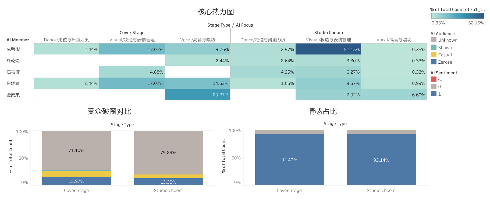

# ZB1 跨场景舞台舆情与焦点对比分析
### AI Product Operations & Data Analysis Portfolio
基于大模型 NLP 与 Tableau 商业智能

**交互看板：** [点击访问 ZB1 跨场景舆情对比 Tableau 交互看板](https://public.tableau.com/views/ZB1/Dashboard1?:language=en-US&:sid=&:redirect=auth&:display_count=n&:origin=viz_share_link)
> 推荐在 PC 端点击访问交互式看板，可自由切换维度联动查看细分数据。

Github：https://github.com/tzey04/zb1_cmt_analysis

---

## 一、业务背景与分析目标

在当前的数字流媒体与粉丝经济时代，偶像团体的舞台物料承载着不同层级的商业使命。本项目选取 ZB1（ZeroBaseOne）的两种典型舞台形态进行对比：

- **翻唱舞台（Cover Stage）：** 侧重致敬经典与情感共鸣。
- **专业舞蹈频道（Studio Choom）：** 侧重极致的视觉冲击与唱跳实力展现。

**核心目标：** 通过量化受众的关注焦点、情感倾向及圈层分布，分析两种舞台形式在"固粉"与"破圈"上的效能差异，从而为未来的内容宣发、资源配置和运营策略提供数据支撑。

---

## 二、数据工程流（Data Pipeline）

本项目跑通了端到端的数据采集、清洗与可视化全链路，体现从原始数据到业务决策的完整工程落地能力。

**1. NLP 自动化打标**
调用大语言模型 API，对 YouTube 上收集的非结构化多语言评论进行深度语义分析，提取出四个结构化字段：`AI_Sentiment`（情感）、`AI_Focus`（关注点）、`AI_Audience`（受众圈层）、`AI_Member`（讨论成员）。正式跑批全量数据前，先抽取 5 条评论进行小样本试跑，人工核对打标结果与原文语义一致后，再批量执行剩余样本的自动化标注，降低模型幻觉与格式漂移带来的数据质量风险。

**2. 数据清洗与聚合（SQL）**
针对数据爬取过程中产生的并发重复问题，运用 MySQL 窗口函数进行去重：

```sql
SELECT *
FROM (
    SELECT *,
           ROW_NUMBER() OVER (
               PARTITION BY textDisplay
               ORDER BY AI_Sentiment DESC
           ) AS rn
    FROM zb1_comments_raw
) t
WHERE rn = 1;
```

最终构建出高质量分析底表，包含 **1,357 条唯一高价值评论**。

**3. BI 可视化分析（Tableau）**
通过 `UNION` 联合两个场景（Cover Stage / Studio Choom）的数据源，并使用"相对百分比（Pane/Cell）"表计算消除两场景数据量级差异带来的偏差，构建全局联动的四象限高管全景看板（Executive Dashboard）。

---

## 三、BI 数据看板



---

## 四、核心商业洞察（Key Insights）

### 洞察一：受众焦点偏移 —— "视觉包装"反超"纯技术展示"

Tableau 核心热力图揭示出显著的焦点反差：Studio Choom 本质上是一档以 Dance 为核心的舞蹈栏目，但在受众反馈中，针对成韩彬"Visual（妆造与表情管理）"的讨论量占比高达 **52.15%**，形成了极端的流量虹吸效应。这说明在强视觉包装的物料中，运镜与妆造的边际收益极高，"视觉氛围"的权重往往能反超"纯肢体技术"本身。

### 洞察二：场景竞争力互补 —— 听觉固本，视觉吸粉

在翻唱舞台（Cover Stage）中，核心焦点发生了平滑转移：金泰来的"Vocal（高音与唱功）"讨论占比达到 **29.27%**，成为该场景下的最强记忆点。这证明不同内容形态承载着不同的业务使命——翻唱舞台精准承接了受众对音色质感和情感爆发力的期待，是展现特定成员业务纵深的最佳渠道。

---

## 五、受众破圈转化漏斗分析

通过 100% 堆积图对比两场景的受众圈层分布（`AI_Audience`），呈现出清晰的流量漏斗差异：

| 舞台类型 | 受众构成特征 | 运营定性分析 |
|---|---|---|
| **Studio Choom** | Unknown: 79.89%<br>Zerose: 13.35% | "广撒网"式的顶层曝光池。庞大的 Unknown 比例说明该频道凭借自身算法权重与极具视觉冲击力的封面，成功触达了海量泛泛路人，是绝佳的拉新触点。 |
| **Cover Stage** | Zerose: 15.97%<br>Shawol: ~2% | "准定向"的深层固粉与跨圈转化。不仅核心粉丝占比更高，还精准捕获了原唱粉丝群体（Shawol）。这属于一次高净值的"定向吸粉"转化。 |

> 注：以上为两场景中占比最具业务解读价值的圈层数据，各场景受众圈层合计为 100%，其余为 Casual / 其他细分。

---

## 六、策略沉淀与业务建议（Recommendations）

**高规格视觉舞台（打歌 / Choom）：** 应将运营预算和沟通精力向"服化道（Styling）"及"单人直拍的表情捕捉"倾斜。视觉表现力是路人盘转化的最核心杠杆。

**纯享版音乐舞台（翻唱 / 电台）：** 在企划初期，选曲策略应重点锁定"容易引发前辈粉共鸣的经典曲目"，并通过成员的 Vocal 分配制造反差感，以此作为低成本跨圈层拉新的抓手。

**平台内容分发启示：** 两种舞台形态适配不同的分发场景——视觉向内容适合作为首页 / 推荐流的冷启动素材以承接泛流量曝光，听觉向内容更适合作为精准推送给已有明确音乐偏好用户的深度转化素材，二者应差异化配置到不同的产品位。

---

## 七、方法局限性

- **样本口径差异：** 两场景视频的发布时长、算法冷启动阶段可能不同，评论量级本身存在差异，虽已通过相对百分比表计算消除量级偏差，但发布时间窗口不一致仍可能影响横向可比性。
- **AI 标注的可靠性边界：** 全量 1,357 条数据仍未做系统性抽样复核（如随机抽取 10% 人工二次标注计算一致率），情感极性与关注点等主观性较强的维度存在模型误判风险。
- **"粉籍身份"判定的局限：** `AI_Audience` 依赖评论文本中的语义线索（如是否提及原唱团体、是否使用粉丝黑话）进行推断，无法访问用户真实行为数据（如听歌历史、关注列表），存在一定误判可能。

## 八、未来展望

- 将场景对比扩展至更多舞台形态（如打歌舞台、直拍、幕后花絮），验证"视觉 vs 听觉"焦点分布规律是否可复制；
- 引入人工抽样复核环节，量化 AI 标注准确率，形成标注质量的置信区间；
- 若接入真实业务场景，可基于本框架对音乐流媒体平台站内不同形式的舞台内容进行 A/B 测试，验证"按场景差异化分发"策略相较"无差别分发"在停留时长、完播率上的实际提升幅度。

## 九、项目复盘

相比单场景分析，本次跨场景对比在数据工程上新增了两个关键动作：一是用 SQL 窗口函数解决多来源数据合并后的重复问题，二是在 Tableau 中通过相对百分比表计算消除了两个场景数据量级不对等带来的可比性偏差。这个过程让我理解到，"横向对比类"分析的价值往往不在于单一维度的绝对数字，而在于如何设计一套公平的对比口径——这也是我认为内容数据分析岗位中最具迁移价值的实践经验之一。

---

*本报告数据均来自公开 YouTube 评论区抓取及 AI 自动化标注，样本量与标注方法详见第二部分，具体方法局限性详见第七部分。*
